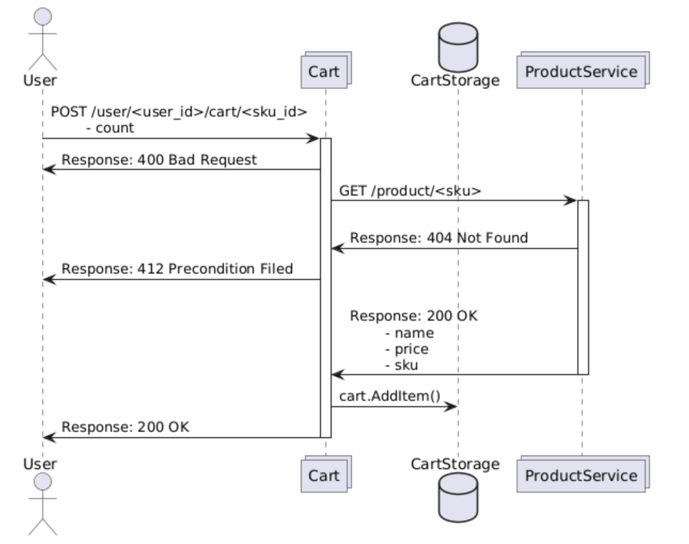
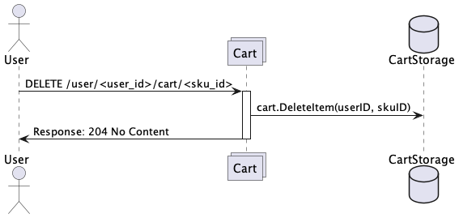
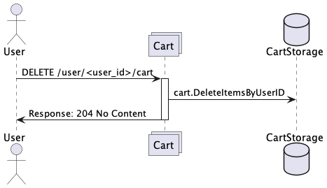
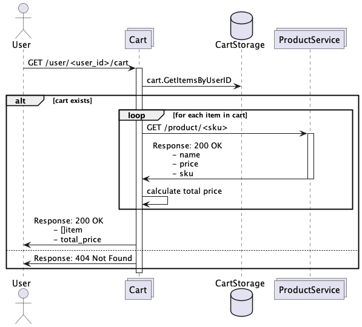

# Домашние задания по модулю "Основы Go"

Необходимо реализовать сервис для работы с корзиной пользователя Cart

## Основное задание

  Необходимо имплементировать сервис, отвечающий за работу с корзиной пользователя (сервис Cart). Логика работы методов
и их контракты описаны ниже.

Требования к решению:

1. Используем HTTP, на основе стандартной библиотеки Go 1.23
2. Для определения существования товара делаем поход в сервис `products`
3. Состояние храним в in-memory, персистентное хранилище на данный момент не требуется
4. Никакого резерва стоков не делаем, логика простейшая

## Дополнительное задание

1. Делаем Middleware, который будет логировать поступающие запросы
2. Делаем валидацию входящих структур на основе любой open-source библиотеки (Можно подсмотреть
   тут - https://awesome-go.com/validation/)
3. Делаем ретраи в `products` на 420/429 статус в виде Client Middleware. 3 ретрая, потом ошибка

## Спецификация

### Добавить товар в корзину

  Идентификатором товара является числовой идентификатор SKU. Метод добавляет указанный товар в корзину 
определенного пользователя. Каждый пользователь имеет числовой идентификатор userID. При добавлении в корзину 
проверяем, что товар существует в специальном сервисе.

Один и тот же товар может быть добавлен в корзину несколько раз, при этом количество экземпляров складывается.

Метод должен вернуть ответ в статусе: 
- **200** — если всё успешно
- **412** — если указан несуществующий товар
- **400** — при других ошибках в запросе

| Метод | URI                                             |
|-------|-------------------------------------------------|
| POST  | /user/<user_id>/cart/<sku_id>                   |

**Параметры запроса:**

| Параметр | Тип параметра | Тип данных | Пример | Описание                                                         |
|----------|---------------|------------|--------|------------------------------------------------------------------|
| user_id  | query path    | int64      | 1007   | Идентификатор пользователя, в корзину которого добавляется товар |
| sku_id   | query path    | int64      | 2008   | Идентификатор товара, добавляемого в корзину                     |
| count    | body          | uint32     | 12     | Количество товаров, добавляемое в корзину                        |

**Параметры ответа:**

отсутствуют

**Диаграмма последовательности:**




### Удалить товар из корзины

  Метод полностью удаляет все количество товара из корзины пользователя. Если у пользователя вовсе нет данной позиции, 
то возвращается такой же ответ, как будто бы все позиции данного sku были успешно удалены 

| Метод  | URI                                             |
|--------|-------------------------------------------------|
| DELETE | /user/<user_id>/cart/<sku_id>                   |

**Параметры запроса:**

| Параметр | Тип параметра | Тип данных | Пример | Описание                                                         |
|----------|---------------|------------|--------|------------------------------------------------------------------|
| user_id  | query path    | int64      | 1007   | Идентификатор пользователя, в корзину которого добавляется товар |
| sku_id   | query path    | int64      | 2008   | Идентификатор товара, удаляемого из корзины                      |

**Параметры ответа:**

отсутствуют

**Диаграмма последовательности:**




### Очистить корзину пользователя

  Метод полностью очищает корзину пользователя. Если у пользователя нет корзины или она пуста, то, как и при успешной
очистке корзины, необходимо вернуть код ответа 204 No Content.

| Метод  | URI                  |
|--------|----------------------|
| DELETE | /user/<user_id>/cart |

**Параметры запроса:**

| Параметр | Тип параметра | Тип данных | Пример | Описание                                                         |
|----------|---------------|------------|--------|------------------------------------------------------------------|
| user_id  | query path    | int64      | 1007   | Идентификатор пользователя, в корзину которого добавляется товар |

**Параметры ответа:**

отсутствуют

**Диаграмма последовательности:**




### Получить содержимое корзины

  Метод возвращает содержимое корзины пользователя на текущий момент. Если корзины у переданного пользователя нет,
либо она пуста, следует вернуть 404 код ответа. Товары в корзине упорядочены в порядке возрастания sku.

| Метод | URI                      |
|-------|--------------------------|
| GET   | /user/<user_id>/cart     |

**Параметры запроса:**

| Параметр | Тип параметра | Тип данных | Пример | Описание                                                         |
|----------|---------------|------------|--------|------------------------------------------------------------------|
| user_id  | query path    | int64      | 1007   | Идентификатор пользователя, в корзину которого добавляется товар |

**Параметры ответа:**

| Параметр       | Тип данных | Пример                                           | Описание                                     |
|----------------|------------|--------------------------------------------------|----------------------------------------------|
| items[i].sku   | int64      | 2008                                             | Идентификатор товара в корзине пользователя  |
| items[i].name  | string     | "Гречка пропаренная, в пакетиках для варки, 400" | Наименование товара                          |
| items[i].count | uint32     | 10                                               | Количество единиц товара                     |
| items[i].price | uint32     | 16                                               | Стоимость единицы товара в условных единицах |
| total_price    | uint32     | 160                                              | Суммарная стоимость всех товаров в корзине   |


**Пример ответа:**

```json
{
    "items" : [
        {
            "sku": 2958025,
            "name": "Roxy Music. Stranded. Remastered Edition",
            "count": 2,
            "price": 1028
        },
        {
            "sku": 773297411,
            "name": "Кроссовки Nike JORDAN",
            "count": 1,
            "price": 2202
        }
    ],
    "total_price": 4258
}
```

**Диаграмма последовательности:**




## Взаимодействие с Product service

Если, вызвав `make run-all`, развернуть деплоймент, swagger этого сервиса  
можно увидеть локально по адресу: [http://localhost:8082/docs/](http://localhost:8082/docs/)

Сервис поддерживает следующие операции: 


#### GET /product?count=10&start_after_sku=0

Эта операция имеет два необязательных параметра:  
 - `count` — сколько элементов вернуть и
 - `start_after_sku` — после какого элемента начать вывод. 

Response:
```
[
    {
        name  string
        price int32
        sku   int64 
    },
]
```

#### GET /product/&lt;sku>

Эта операция выводит данные товара с заданным `sku`.

Response:
```
    {
        name  string
        price int32
        sku   int64 
    }
```

Обратите внимание, сервис `products` отдаёт цены в `int32` формате.  
В JSON нет беззнаковых целых, поэтому `int32`.  
Вам же, внутри своих сервисов, для совместимости их между собой  
следует использовать беззнаковый тип `uint32`. 

Также следует обратить внимание на то, что он выведен на `localhost:8082` лишь  
для вашего удобства работы с данными.  

Ваш сервис `cart`, запущенный докер-контейнером, сможет подключиться к `products`  
по адресу `products:8082` — заниматься маршрутизацией будет сам докер.

Авторизация на запрос выполняется с помощью заголовка `X-API-KEY` и токена `testToken`.  

## Makefile

В рамках данного задания необходимо имплементировать следующие таргеты:

- run-all – запускает сервисы. На данный момент их должно стать два: 
  - `products` — уже реализован, распространяется в виде образа,   
    запускаемого в контейнере
  - `cart` — разрабатываемый Вами в качестве домашнего задания

## Ожидаемый результат

- с помощью команды `make run-all` можно запустить приложение
- приложение слушает HTTP запросы на порту 8080
- реализованы API методы
  - POST   /user/<user_id>/cart/<sku_id>
  - DELETE /user/<user_id>/cart/<sku_id>
  - DELETE /user/<user_id>/cart
  - GET    /user/<user_id>/cart
- методы реализуют заявленную бизнес логику
- методы валидируют запросы и отдают описанные в спецификации коды ошибок
- информация о пользователях и их состоянии корзины хранится в памяти приложения
- при рестарте приложения состояние системы теряется

## Сценарии тестирования с примерами запроса (для тьютора)

Сценарий тестирования следует описать в [cart.http](./cart.http)

### Дедлайны сдачи и проверки задания: 
- 22 февраля 23:59 (сдача) / 25 февраля, 23:59 (проверка)
